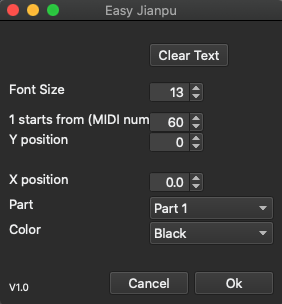

# 使用說明
## 安裝插件
1. 下載最新 EasyJianpu.qml 檔案，並複製到 MuseScore 的 Plugin 資料夾底下。

	**Windows** 路徑為 `%HOMEPATH%\Documents\MuseScore3\Plugins`
	
	
	**macOS** 路徑為 `~/Documents/MuseScore3/Plugins`
	
	**Linux** 路徑為 `~/Documents/MuseScore3/Plugins`
	

2.  開啟 `MuseScore 3`，點選工具列 `外掛模組->外掛模組管理器`。
3. 左邊欄勾選 `EasyJianpu` 並 OK 關閉外掛模組管理器。
4. 點選工具列 `外掛模組-> Easy Jianpu` 即可開啟 `EasyJianpu` 功能視窗。

關於 MuseScore 插件，詳細資訊參考 MuseScore [文件](https://musescore.org/en/handbook/3/plugins)。

## EasyJianpu

### 功能視窗
 

1. Clear Text: 清除所選區域之文字
2. Font Size: 更改簡譜字體大小
3. 1 starts from (MIDI num): 首調中 1 所對應的 MIDI number，預設 60 為 C3。其他例子比如 1=G 的情況數值為 67；1=D 時數值調整為 62，以此類推。
4. Y position: 調整上下位置
5. X position: 調整左右位置
6. Part: 指定聲部
7. Color: 簡譜文字顏色

### 選取範圍

開啟 `EasyJianpu` 之前，若有選擇小節，則只會插入所選區域的簡譜，如圖：

 

如不選取，則會插入至整首樂譜。

### 使用範例

步驟：

1. 選擇樂譜範圍
2. 開啟 `EasyJianpu` 插件
3. 1 starts from (MIDI num) 的數值設定為 67 (1=G)
4. 按 `Ok` 後即出現簡譜

 